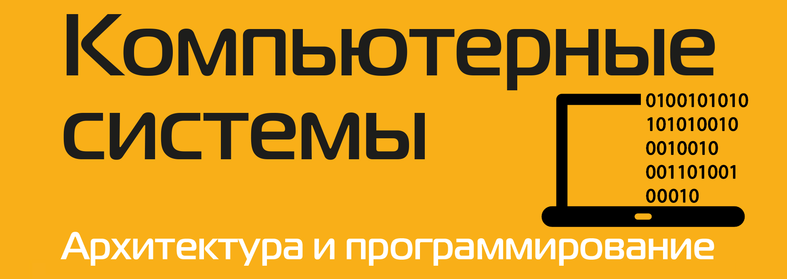

# Computer systems & Assembler

Supplementary course materials in Russian for students. Based mainly on the textbook _Computer Systems: A Programmer’s Perspective_ by Randal E. Bryant and David R. O’Hallaron



_Inspired by all students who are eager to learn_


## Build

The document is written using [LaTeX](https://www.latex-project.org). To build it, just run the command:

```
$ make
```
